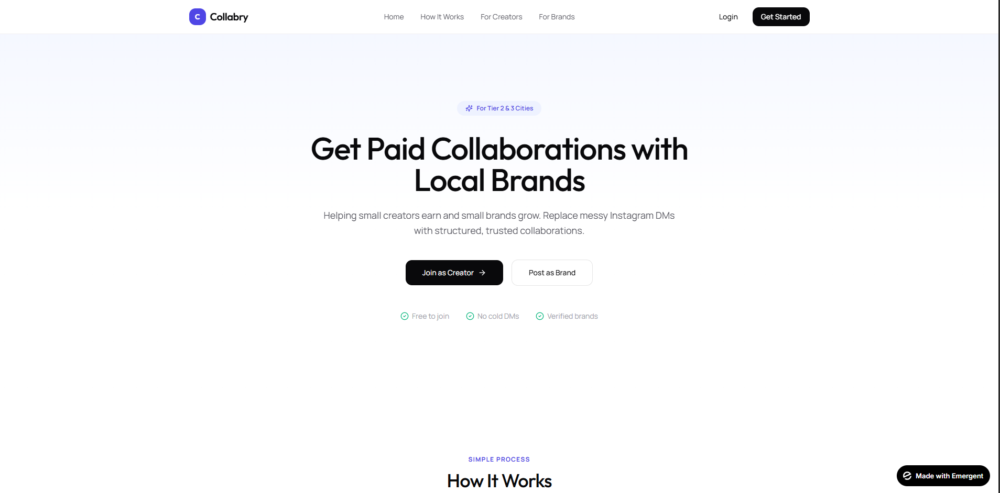
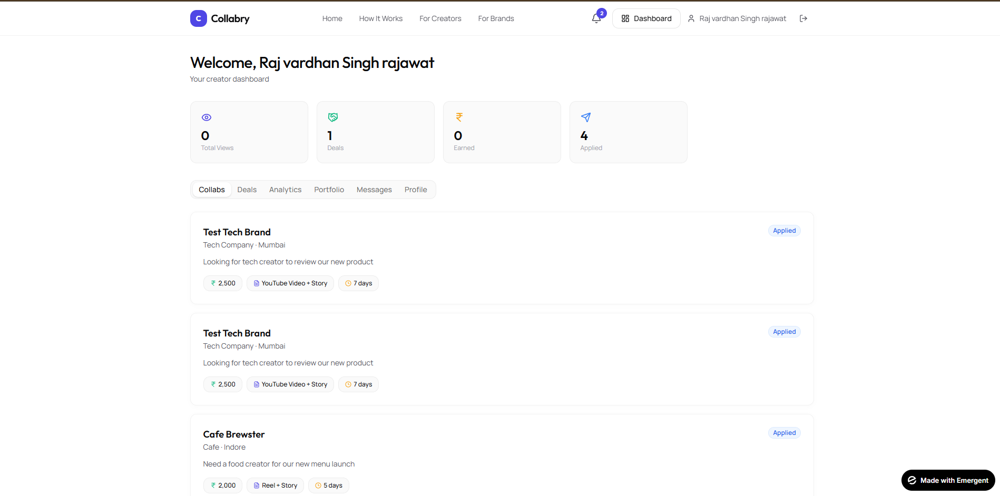
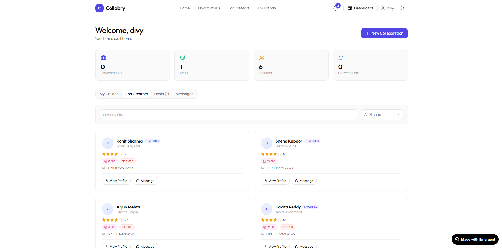
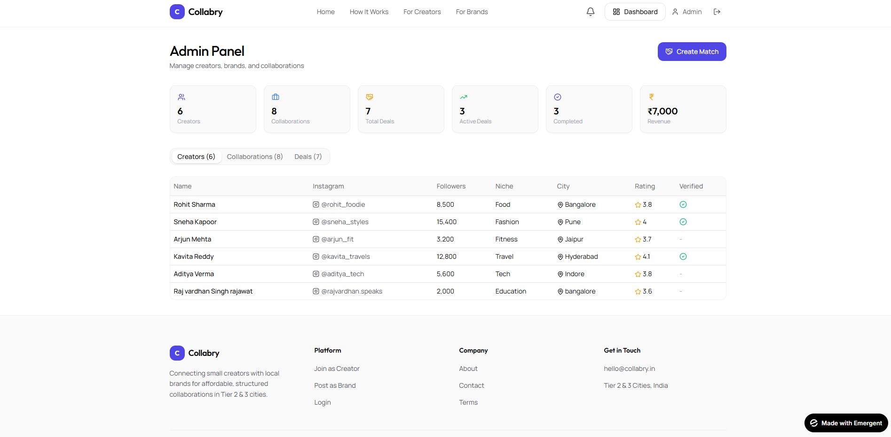

# Collabry 🚀

Collabry is a platform built to make collaborations between creators and brands more structured and reliable.

## Problem
Right now, most collaborations happen through Instagram DMs — which are unorganized, unclear, and often lack trust.

## Solution
Collabry introduces a simple system where creators and brands can connect in a more structured way, with clear profiles and collaboration flow.

## Features
- Creator onboarding  
- Brand collaboration posts  
- Basic matching system (MVP stage)  
- Clean and simple landing interface  

## Demo
https://youtube.com/shorts/e1xuvriESBs?si=ccpSMLNfI3C46nt-

## Build
This is an MVP built to validate the idea and user flow.

## Note
Currently in the prototype stage. The demo video above shows the complete flow and concept.

## Author
Rajvardhan Singh Rajawat

## Screenshots

